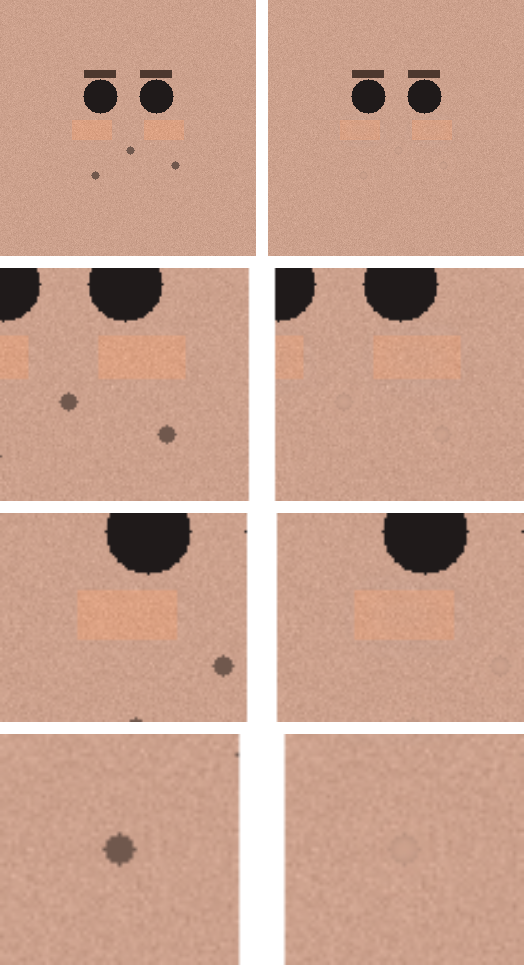

# Actor Headshot Retouch

A retouching tool for actor headshots, body shots, and marketing assets that fixes the usual barbell problem with AI retouching.

- Full AI regeneration looks fake and shifts identity. Casting directors punish that.
- Minimal automated touch-ups miss the real defects or smear them.

This tool takes a third path. A generative model proposes a retouched **target** (what good looks like). Deterministic code then transfers only the validated, local fixes back onto the original high-resolution file. The model never paints the final pixels. Texture, composition, lighting, and likeness stay the original's.


*Top: original. Bottom: the retouch directions the pipeline targets — lid discoloration, under-eye brownness, tear-trough shadows, crepey texture, and eye whites. Each is corrected as a subtle, masked, texture-preserving edit, never a regeneration.*

## Why it stays real

The generated target is treated as **direction, not pixels**.

- Tone and colour fixes (under-eye discoloration, eyelids, neck, hands) transfer as a low-frequency delta. The original's high-frequency texture is re-added on top, so pores and stubble are untouched.
- Marks and blemishes are healed from the original's own surrounding texture, never from the generated image. Generated skin is lower resolution and fabricated; importing it is what makes AI retouches look plastic.
- Any uniform colour cast the model adds is removed before transfer, so complexion never drifts.
- Edits are confined to masked regions, so nothing leaks into cheeks, eye whites, or background.

## How it works

```
original ──▶ generate target ──▶ align to original ──▶ frequency-separated
                (OpenAI)            (ECC / ORB)          touch-up map
                                                              │
   versioned output ◀── QA gates ◀── blend onto original ◀── region masks
   + contact sheet      (identity,     (masked tone delta,    (tone vs heal)
   + JSON report         SSIM, ΔE,      heal from original
                         texture)       texture)
```

Each stage is a small, testable module in [`retoucher/`](actor-headshot-retouch/retoucher).

Every run also writes a before/after contact sheet so you can judge the result at 100%:



*Automated QA output on synthetic data (reproduce with `python actor-headshot-retouch/examples/make_example.py`): marks healed, under-eye tone corrected, pore texture and identity intact.*

## Quality gates

Every run is graded automatically. A gate whose optional backend is missing is reported as `skipped`, never silently passed. The verdict is `reject` if any gate fails; the artifact is still written for inspection.

| Gate | Checks | Backend |
| --- | --- | --- |
| `identity` | ArcFace cosine similarity before/after (no identity drift) | InsightFace (optional) |
| `untouched_ssim` | regions that should not change stay near-identical | core |
| `untouched_lpips` | perceptual distance off-edit | LPIPS/torch (optional) |
| `edited_delta_e` | the edit is visible (CIEDE2000) and not a cartoon | core |
| `texture` | high-frequency energy not lost (no plastic skin) | core |

## Install

Core pipeline (everything above runs on these four):

```bash
python -m pip install ./actor-headshot-retouch
```

Optional stronger masks and gates (face-landmark regions, identity check, perceptual check, RAW input):

```bash
python -m pip install "./actor-headshot-retouch[advanced]"
```

For real runs against OpenAI, add the SDK and set a key:

```bash
python -m pip install "./actor-headshot-retouch[openai]"
export OPENAI_API_KEY=sk-...
```

## Use

```bash
# Offline smoke (mock generator, no API key, no cost):
retoucher headshot.jpg --dry-run --out-dir out

# Real run against OpenAI:
retoucher headshot.jpg --mode hybrid-map --out-dir out

# Batch a whole shoot:
retoucher ./shoot --out-dir ./shoot-retouched
```

Each run writes a versioned image (the original is never overwritten), a before/after contact sheet, and a JSON report with the alignment method and every QA gate.

Python API:

```python
from retoucher import OpenAIGenerator, PipelineConfig
from retoucher.pipeline import retouch_image

res = retouch_image("headshot.jpg", "out", OpenAIGenerator(), PipelineConfig(mode="hybrid-map"))
print(res.qa.verdict, res.report["qa"])
```

## The model is swappable

OpenAI `gpt-image-2` (the current latest) is the default. It resolves from the `OPENAI_IMAGE_MODEL` environment variable, then `--model`, so when OpenAI ships the next model you point at it with no code change:

```bash
export OPENAI_IMAGE_MODEL=gpt-image-3   # or pass --model gpt-image-3
```

The generator is still the weakest part of the chain for this workflow (it tends to regenerate and recolor), but the pipeline never trusts its pixels globally, so the model matters less than in a regenerate-everything tool. To swap in FLUX.1 Kontext, Gemini, or a local model, implement the one-method `Generator` interface in [`retoucher/generate.py`](actor-headshot-retouch/retoucher/generate.py); nothing else changes.

## Limitations

- Alignment can fail when the generated target differs a lot in pose or expression. The pipeline falls back (ECC, then ORB), flags low confidence, and the identity gate catches drift.
- The generator must keep the same crop and framing for a clean transfer. The prompts ask for this; a model that recrops will produce weaker results.
- Face-region masks are most precise with the optional MediaPipe backend; without it the tool edits where the target proposed a change, refined by a skin estimate.
- The demo image is synthetic. Real before/after quality depends on the source photo and the generator.
- Privacy: a real run uploads your image to the generator's API (OpenAI by default); review their data policy first. Offline `--dry-run` and the test suite never leave your machine.

## Repository layout

This is both a runnable Python package and a Codex/agent skill.

```
actor-headshot-retouch/
├── retoucher/          the pipeline (align, diff, mask, blend, qa, cli)
├── scripts/            check_readiness.py preflight
├── tests/              offline test suite (mock generator)
├── examples/           reproducible before/after demo
├── SKILL.md            agent behaviour spec
├── references/         retouch standards and prompts
└── pyproject.toml
```

To use it as a Codex skill, copy the `actor-headshot-retouch` folder into your skills directory and invoke it; the skill runs the same pipeline described here.

## Develop

```bash
python -m pip install -e "./actor-headshot-retouch[dev]"
pytest actor-headshot-retouch/tests -q
```

Tests run fully offline with a mock generator, so no API key or network is needed. They bootstrap the package onto the path, so `pytest` and `python examples/make_example.py` work straight from a clone even without installing. (Editable installs have a known import-resolution quirk on the Python 3.14 preview; use a regular `pip install` there. Supported and CI-tested on 3.10 to 3.12.)
